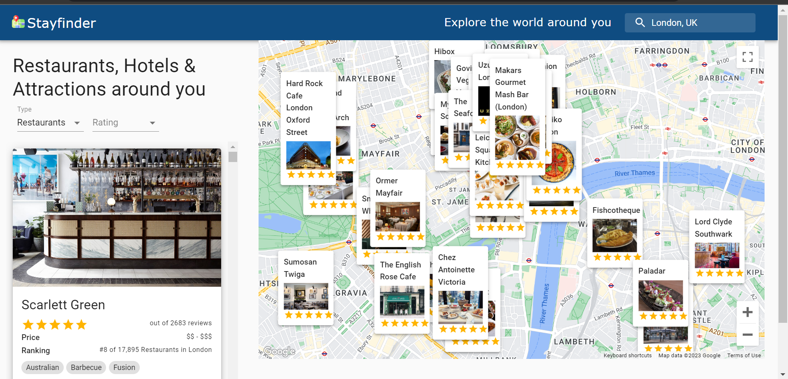

# Google Map Companion
[Stayfinder Demo](https://stayfinder-explore.netlify.app/)
**Location is Required for Loading of site**

Fully-responsive travel companion app built by combining **Google Maps API**, **Travel Advisor API**. Built using React.js and Material UI, this app can be used to search for places, fetch restaurant, hotels and attractions based on location.

## Table of Contents
- [Demo Videos](#demo-videos)
- [Dependencies](#dependencies)

## Demo Videos

### Demo
- Search anywhere in earth for the restaurants , Hotels and attractions. [Default : User Location]
- Filter by ratings

https://user-images.githubusercontent.com/72428146/227994167-1e6315cc-b9ee-4e36-a0d1-d28881f50d56.mp4

## Dependencies
- [React](https://reactjs.org/)
- [google-map-react](https://github.com/google-map-react/google-map-react)
- [@react-google-maps/api](https://react-google-maps-api-docs.netlify.app/)
- [Axios](https://axios-http.com/docs/intro)
